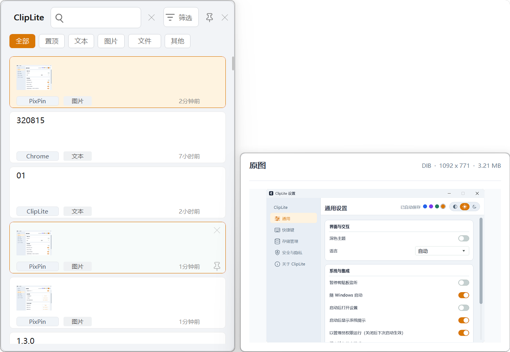
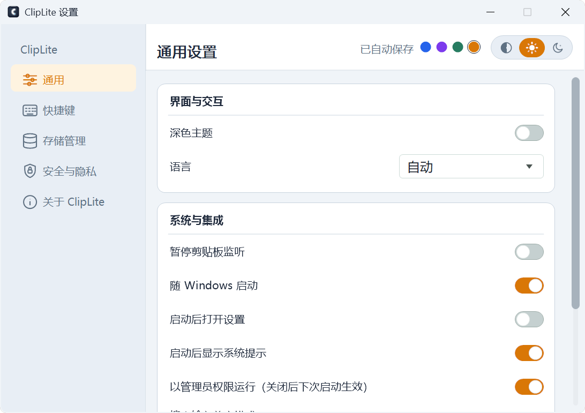

# ClipLite

ClipLite 是一款仅支持 Windows 的原生剪贴板历史工具。它使用 C++17、Win32 API 和 GDI/GDI+ 构建，不依赖 WebView、Electron、WinUI、Qt 或其他大型运行时，重点是低常驻内存、可靠保存剪贴板格式和便携发布。

当前正式版本：**1.0.1**（x64）

英文文档：[README.en.md](README.en.md)

## 项目初衷

AI 应用快速发展后，存储成本持续上升，内存和设备资源也越来越宝贵。很多桌面工具只是放在后台，也会长期占用一大块空间和内存。

ClipLite 从一开始就希望把剪贴板历史做得更克制：程序尽量小，后台尽量省内存，历史内容需要时再读取。省下来的每一点资源，都可以留给真正重要的应用和工作内容。

## 功能

- 使用 `Alt+V` 打开历史窗口，可选替换 Windows 的 `Win+V`。
- 捕获并恢复纯文本、HTML、文件列表、DIB 和 DIBV5 图片。
- 支持搜索、按类型筛选、置顶、删除、清空和自动粘贴。
- 支持纯文本粘贴和富文本粘贴，图片只在可见时按需读取。
- 支持自动、浅色和深色主题，以及蓝色、紫色、绿色和橙色强调色。
- 支持英文和简体中文界面。
- 支持最大记录数、磁盘空间、保留天数、单条内容大小和暂停监听设置。
- 支持按来源应用忽略内容、敏感文本自动过期和 Windows DPAPI 用户级加密。
- 支持普通安装模式和便携模式，不创建常驻工作线程，不在内存中保存完整历史正文。

## 界面预览

历史窗口（含图片记录）：



设置窗口：



## 性能与体积

ClipLite 专注于“常驻但不打扰”：相比常见剪贴板工具，占用更少内存，适合长期在后台运行，也不需要额外运行时。

- 后台运行时，本机任务管理器观察到的内存约为 `2.5 MB`。
- 主程序约 `446 KB`，比一张普通手机照片还小。
- 启动约 `0.06 秒`，打开历史窗口后才按需读取内容和图片。
- 历史窗口缓存最近显示的图片缩略图，连续滚动不会重复读取和解码同一原图。

这意味着它适合长期后台运行，也适合放在 U 盘或便携目录中使用。

<details>
<summary>查看详细测量条件</summary>

当前 Windows x64 Release 本机实测：Working Set `13.16 MB`、Private Bytes `2.59 MB`、主程序 `446.5 KB`、启动耗时 `59.14 ms`、GDI `13`、USER `9`。任务管理器和测量工具的内存统计口径不同，因此显示数值可能不同。

数据由 `tools/measure.ps1` 在程序启动约 1 秒后、未打开历史窗口的空闲状态采样。实际数值会受到 Windows 版本、DPI、系统状态、历史数据和运行场景影响，这些数据是本机 Release 参考值，不是所有设备上的固定承诺。

</details>

## 为什么选择 ClipLite

ClipLite 更适合希望“复制过的内容方便找回，但程序不要拖慢电脑”的用户。

| 对比项目 | ClipLite | 常见剪贴板工具 |
| --- | --- | --- |
| 后台占用 | 轻量设计，本机空闲观察约 `2.5 MB` | 功能越多，常驻占用通常越高 |
| 程序体积 | 主程序约 `446 KB` | 依赖运行时或集成功能后通常更大 |
| 运行方式 | 原生 Win32，无 WebView 和大型运行时 | 部分工具依赖额外运行时或框架 |
| 数据控制 | 历史默认保存在本机，可选 DPAPI 加密 | 数据位置和隐私策略因工具而异 |
| 使用方式 | 支持安装版和便携版，可放在 U 盘 | 通常以安装版为主 |
| 内容支持 | 文本、HTML、图片、文件列表均可保存和恢复 | 格式支持范围因工具而异 |
| 资源读取 | 图片和完整内容按需读取，不一次性加载全部历史 | 大量历史内容可能带来更高读取和内存压力 |
| 软件定位 | 源码可查看，非商业授权，专注剪贴板历史 | 商业软件或功能更复杂的综合工具较多 |

不同工具的功能和版本差异较大，上表用于说明产品定位，不是统一环境下的跑分排名。

## 下载和运行

正式发布包含两种 Windows x64 形式：

- 安装包：`ClipLite-Setup-1.0.1-x64.exe`。支持自定义安装目录、开始菜单/桌面快捷方式和标准卸载。
- 便携包：`ClipLite-1.0.1-portable-win-x64`。复制整个目录即可使用，数据保存在其中的 `data\\` 目录。

便携包中的 `SHA256SUM.txt` 用于校验 `ClipLite.exe`。首次运行前请确认下载来源和文件校验值。

## 快捷键

- `Alt+V`：打开剪贴板历史。
- `Enter` 或鼠标单击：粘贴当前项目。
- `Ctrl+Shift+V`：粘贴为纯文本。
- `Ctrl+Shift+R`：粘贴为富文本（仅富文本记录可用）。
- `Delete`：删除当前项目。
- `Esc`：关闭历史窗口。
- `F10`：打开设置。
- `Ctrl+0`：清除历史筛选。

设置页可以修改历史、设置和暂停监听快捷键。`Win+V` 替换受 Windows、权限级别和其他软件快捷键占用情况影响，注册失败时会保留 `Alt+V`。

## 数据和隐私

普通安装模式默认使用以下目录：

- 历史：`%LOCALAPPDATA%\\ClipLite\\history.bin`
- 设置：`%LOCALAPPDATA%\\ClipLite\\settings.ini`
- 诊断日志：`%LOCALAPPDATA%\\ClipLite\\cliplite.log`

便携模式使用便携包内的 `data\\` 目录；自定义缓存目录可以在设置页中修改。ClipLite 不把剪贴板正文写入诊断日志，也不会把用户数据写入源码仓库。

DPAPI 加密默认关闭。启用后，历史正文只能由同一 Windows 用户恢复。清空历史会删除本地历史文件；暂停监听可以临时避免保存新的内容。敏感内容过期默认关闭，只对包含明确敏感标记的文本进行检测。

ClipLite 无法绕过 Windows UIPI。向管理员权限或受保护窗口自动粘贴可能失败；UAC 安全桌面、登录界面和其他桌面会话不属于支持范围。

## 构建

要求 Windows、Visual Studio 2019 或更高版本，以及 CMake 3.15 或更高版本。构建目标固定为 x64。

```pwsh
cmake -S . -B build-x64 -A x64 -DBUILD_TESTING=ON
cmake --build build-x64 --config Release
ctest --test-dir build-x64 -C Release --output-on-failure
```

生成便携包和可选安装包：

```pwsh
powershell -ExecutionPolicy Bypass -File packaging/package.ps1
```

输出位于 `build-x64\\Release\\` 和 `out\\`。开发和测试细节见 [CONTRIBUTING.md](CONTRIBUTING.md)，版本变更见 [CHANGELOG.md](CHANGELOG.md) 和 [CHANGELOG.en.md](CHANGELOG.en.md)。

## 命令行参数

- `ClipLite.exe --history`：启动并打开历史窗口。
- `ClipLite.exe --settings`：启动并打开设置窗口。
- `ClipLite.exe --exit`：请求已运行实例退出。

## 许可证

ClipLite 使用 [PolyForm Noncommercial License 1.0.0](LICENSE.md) 授权。该授权允许个人、教育、研究和其他非商业用途使用、学习、修改和分发源码或程序，但禁止销售、收费分发、商业集成和其他商业用途。

这是一份 source-available（公开源码）许可证，不是 OSI 认可的“开源许可证”。如果需要商业使用或商业分发，请先与版权所有者取得书面商业授权。第三方依赖和资源可能有独立许可证或权利声明，使用时应分别遵守。

## 反馈和安全问题

普通问题请提交 Issue，并附上 Windows 版本、ClipLite 版本、复现步骤和相关日志片段。日志可能包含路径或进程名称，请在公开前检查并删除敏感信息。

安全漏洞不要公开发布利用细节，请先阅读 [SECURITY.md](SECURITY.md)；英文安全说明见 [SECURITY.en.md](SECURITY.en.md)。
